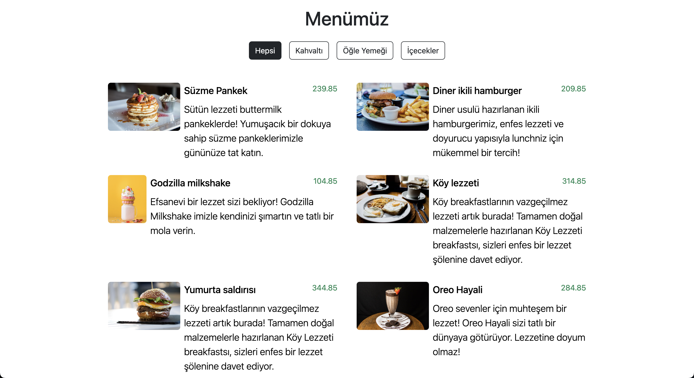
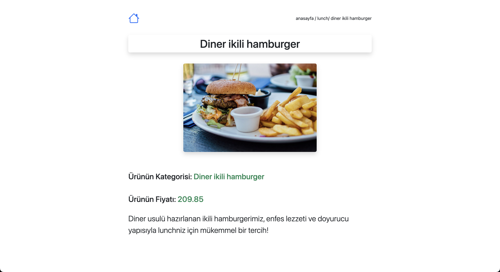

# QR-menu

QR-menu is a simple product listing application built with JavaScript, HTML, and Bootstrap. On the main page, users can view a list of products, and by clicking on a product, they can navigate to a detail page displaying further information about the selected product.

## Screenshots

## Video gif


### home page



### about page



## Project Features

- **Main Page (index.html):** Product data from `db.js` is displayed as a list on the main page.
- **Detail Page (detail.html):** When a user clicks on a product, they are directed to a detail page where more information about the selected product is shown.
- **Bootstrap:** The interface is styled with Bootstrap, providing a clean and user-friendly layout.

## Technologies Used

- **JavaScript:** For functionality and interactivity.
- **HTML:** For structuring the web pages.
- **Bootstrap:** For styling and layout.

## Project Structure

## Usage

- Displaying Data: Product data from db.js is shown as a list on the index.html page.
- Product Details: When a user clicks on a product, they are redirected to the detail.html page, where detailed information about the product is displayed.

### How to Run

- Clone or download the project to your computer.
- Open the index.html file in a web browser to view the main page.
- Click on any product to view its details on the detail page.

## Installation

1. Clone this repository to your local machine:
   ```bash
   git clone https://github.com/ozerbaykal/QR-Menu-Js.git
   ```
2. Open the `index.html` file in your preferred browser to view the project.

<h2>Contributing</h2>

Contributions are welcome! Please open an issue first to discuss what you would like to change.

- 1.Fork the project
- 2.Create your feature branch (git checkout -b feature/NewFeature)
- 3.Commit your changes (git commit -m 'Add new feature')
- 4.Push to the branch (git push origin feature/NewFeature)
- 5.Open a Pull Request

<h2>Contact</h2>

Özer BAYKAL mail : baykalozer87@gmail.com

Project Link: https://github.com/ozerbaykal/QR-Menu-Js
